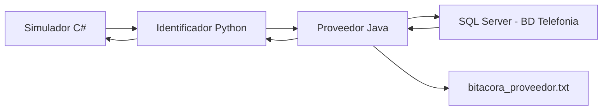

# Documentacion de integracion - Proveedor Java

Proyecto: Sistema de Control de Llamadas Telefonicas  
Componente: Proveedor Telefonico XYZ  
Tecnologia: Java + SQL Server + Socket TCP + JSON

## 1. Resumen

Este documento explica como funciona el componente **Proveedor Java**, que historias cubre, que datos recibe, que datos responde y que deben tomar en cuenta los modulos de **Python** y **C#** para integrarse correctamente.

El Proveedor Java cubre estas historias:

- `PROVEEDOR1`: verificar saldo telefonico y autorizar inicio de llamadas.
- `PROVEEDOR2`: registrar llamadas y rebajar saldo en cuentas prepago.
- `PROVEEDOR3`: registrar bitacora de operaciones.

La comunicacion con el Proveedor Java se realiza mediante **socket TCP** usando mensajes **JSON**.

## 2. Arquitectura general



Flujo esperado:

1. El simulador C# envia una solicitud al Identificador Python.
2. Python valida los datos generales del telefono, tarjeta, ubicacion y destino.
3. Python envia a Java el JSON correspondiente.
4. Java consulta SQL Server, calcula tarifas, valida saldo o registra llamadas.
5. Java responde a Python con JSON.
6. Python responde al simulador C#.

## 3. Responsabilidad de cada integrante/modulo

### C# - Simulador de llamadas

El simulador representa los telefonos de los clientes.

Debe encargarse de:

- capturar los datos de una solicitud de llamada;
- capturar los datos para iniciar llamada;
- capturar los datos para finalizar llamada;
- capturar solicitudes de consulta de saldo;
- enviar la informacion al Identificador Python;
- mostrar al usuario la respuesta final.

C# no debe calcular tarifas del proveedor.

### Python - Identificador

Python es el intermediario entre C# y Java.

Debe encargarse de:

- recibir tramas desde C#;
- validar datos obligatorios;
- validar telefono origen;
- validar identificador del telefono;
- validar identificador de tarjeta;
- validar ubicacion geografica;
- validar telefono destino nacional o codigo pais internacional;
- decidir si la solicitud es llamada, saldo, inicio o finalizacion;
- enviar solicitudes al Proveedor Java cuando corresponda.

Python no deberia calcular las tarifas del proveedor. Debe enviar a Java la informacion necesaria para que Java calcule.

### Java - Proveedor Telefonico XYZ

Java se encarga de:

- consultar cuentas en SQL Server;
- saber si una cuenta es prepago o postpago;
- consultar saldos;
- calcular tarifas nacionales e internacionales;
- autorizar o rechazar llamadas;
- registrar llamadas terminadas;
- rebajar saldo en cuentas prepago;
- responder JSON a Python;
- guardar bitacora de entradas y salidas.

## 4. Como ejecutar el Proveedor Java

### 4.1 Requisitos

En la maquina donde se ejecute Java se necesita:

- JDK instalado.
- Maven o un IDE que soporte proyectos Maven, como NetBeans o IntelliJ.
- SQL Server instalado o accesible.
- Base de datos `Telefonia` creada con el script del proveedor.
- Puerto del socket libre, por defecto `6000`.

### 4.2 Abrir el proyecto

Abrir esta carpeta como proyecto Maven:

```text
Proveedor-java
```

El archivo importante de Maven es:

```text
Proveedor-java/pom.xml
```

Si NetBeans marca error en:

```java
import org.json.JSONObject;
```

significa que no cargo la dependencia Maven. En ese caso:

1. Abrir el proyecto como Maven Project.
2. Click derecho al proyecto.
3. Usar `Reload Project`, `Reload POM` o `Clean and Build`.
4. Verificar que tenga internet para descargar dependencias.

Dependencias principales:

```xml
<dependency>
    <groupId>org.json</groupId>
    <artifactId>json</artifactId>
    <version>20231013</version>
</dependency>

<dependency>
    <groupId>com.microsoft.sqlserver</groupId>
    <artifactId>mssql-jdbc</artifactId>
    <version>12.6.1.jre11</version>
</dependency>
```

### 4.3 Configurar conexion a SQL Server

La configuracion esta en:

```text
Proveedor-java/src/main/resources/config.properties
```

Ejemplo:

```properties
servidor.puerto=6000
db.url=jdbc:sqlserver://localhost:1433;databaseName=Telefonia;encrypt=true;trustServerCertificate=true
db.user=telefonia_user
db.password=Telefonia2025!
bitacora.archivo=bitacora_proveedor.txt
```

Si usan SQL Server Express con instancia nombrada:

```properties
db.url=jdbc:sqlserver://localhost\\SQLEXPRESS;databaseName=Telefonia;encrypt=true;trustServerCertificate=true
```

Si usan otra maquina o instancia:

```properties
db.url=jdbc:sqlserver://NOMBRE_MAQUINA:1433;databaseName=Telefonia;encrypt=true;trustServerCertificate=true
```

No deberia ser necesario modificar `DatabaseConnection.java`. Cada maquina debe cambiar solamente `config.properties`.

### 4.4 Clase principal

Ejecutar:

```text
servidor.Main
```

Si inicia correctamente, debe verse:

```text
Servidor iniciado en puerto 6000
```

Mientras esa ventana este corriendo, Python puede conectarse a Java.

## 5. Protocolo de comunicacion Java-Python

Java escucha en:

```text
host: localhost
puerto: 6000
```

Python debe enviar:

- un JSON valido;
- en una sola linea;
- terminado con salto de linea `\n`.

Ejemplo Python:

```python
import socket
import json

def enviar_a_java(mensaje):
    cliente = socket.socket(socket.AF_INET, socket.SOCK_STREAM)
    cliente.connect(("localhost", 6000))

    cliente.sendall((json.dumps(mensaje) + "\n").encode("utf-8"))
    respuesta = cliente.recv(1024).decode("utf-8")

    cliente.close()
    return json.loads(respuesta)
```

Java responde tambien con JSON.

## 6. Operacion 1 - Verificar saldo o autorizar llamada

Esta operacion corresponde a `PROVEEDOR1`.

Se usa:

```json
{
  "tipo": "verificar_saldo"
}
```

Dentro de esta operacion existen dos tipos de transaccion:

| Valor | Significado |
|---|---|
| `1` | Autorizar llamada |
| `2` | Consultar saldo |

## 7. Consultar saldo

### JSON que Python envia a Java

```json
{
  "tipo": "verificar_saldo",
  "telefono": "88889999",
  "tipoTransaccion": 2
}
```

Campos:

| Campo | Tipo | Descripcion |
|---|---|---|
| `tipo` | texto | Debe ser `"verificar_saldo"` |
| `telefono` | texto | Numero origen del cliente |
| `tipoTransaccion` | numero | Debe ser `2` para consulta |

### Respuesta si es prepago

```json
{
  "status": "OK",
  "saldo": "0000000000000090246"
}
```

El saldo se envia en 19 digitos. Los ultimos 2 son decimales.

Ejemplo:

```text
0000000000000090246 = 902.46
```

### Respuesta si es postpago

```json
{
  "status": "OK",
  "saldo": "-1"
}
```

### Respuesta con error

```json
{
  "status": "ERROR"
}
```

## 8. Autorizar llamada

### JSON que Python envia a Java

```json
{
  "tipo": "verificar_saldo",
  "telefono": "88889999",
  "tipoTransaccion": 1,
  "tipoLlamada": 3,
  "telefonoDestino": "4915112345678"
}
```

Campos:

| Campo | Tipo | Descripcion |
|---|---|---|
| `tipo` | texto | Debe ser `"verificar_saldo"` |
| `telefono` | texto | Numero origen del cliente |
| `tipoTransaccion` | numero | Debe ser `1` para llamada |
| `tipoLlamada` | numero | `1` mismo proveedor, `2` otro proveedor, `3` internacional |
| `telefonoDestino` | texto | Numero destino |

### Respuesta si se autoriza

```json
{
  "status": "OK",
  "tarifa": "0000000054",
  "tiempo": "275555"
}
```

Campos de respuesta:

| Campo | Descripcion |
|---|---|
| `status` | Resultado de la operacion |
| `tarifa` | Tarifa por minuto en 10 digitos, ultimos 2 son decimales |
| `tiempo` | Tiempo autorizado en formato `HHMMSS` |

Ejemplo de tarifa:

```text
0000000054 = 0.54
0000002513 = 25.13
0000000872 = 8.72
```

### Respuesta si no hay saldo suficiente

```json
{
  "status": "INSUF"
}
```

### Bonos para llamadas al mismo proveedor

Cuando `tipoLlamada` es `1`, Java considera que la llamada es al mismo proveedor. En ese caso, si la cuenta es prepago, el proveedor puede autorizar usando:

```text
saldo + bono_mismo_proveedor
```

Para `tipoLlamada = 2` o `tipoLlamada = 3`, Java usa solamente el saldo normal. Esto permite cumplir el criterio del enunciado que indica que las llamadas al mismo proveedor pueden utilizar bonos o saldos.

### Respuesta si hay error

```json
{
  "status": "ERROR"
}
```

### Caso postpago

Si la cuenta es postpago y la transaccion es llamada, Java responde:

```json
{
  "status": "OK",
  "tarifa": "9999999999",
  "tiempo": "245959"
}
```

Esto significa que la llamada se autoriza sin validar saldo.

## 9. Reglas para telefonoDestino

### Llamadas nacionales

Para llamadas nacionales, Python debe enviar `telefonoDestino` sin prefijo `506`.

Correcto:

```json
{
  "telefonoDestino": "88001234",
  "tipoLlamada": 1
}
```

Incorrecto para nacional:

```json
{
  "telefonoDestino": "50688001234",
  "tipoLlamada": 1
}
```

Java determina si es fijo o movil por el primer digito:

| Primer digito | Tipo destino |
|---|---|
| `6`, `7`, `8` | movil |
| otro | fijo |

### Llamadas internacionales

Para llamadas internacionales, Python debe enviar el numero con codigo pais.

Correcto:

```json
{
  "telefonoDestino": "4915112345678",
  "tipoLlamada": 3
}
```

Tambien se acepta:

```json
{
  "telefonoDestino": "+4915112345678",
  "tipoLlamada": 3
}
```

## 10. Como Java determina tarifa internacional

Si `tipoLlamada` es `3`, Java:

1. toma `telefonoDestino`;
2. elimina el signo `+`, si existe;
3. prueba posibles prefijos;
4. busca el prefijo en `CodigosPais`;
5. obtiene el grupo en `GruposTarifarios`;
6. busca la tarifa en `Tarifas`.

Ejemplo:

```text
telefonoDestino = 4915112345678
prefijos probados = 4915, 491, 49, 4
prefijo encontrado = 49
grupo = D
tarifa = 0.54
```

## 11. Operacion 2 - Registrar llamada

Esta operacion corresponde a `PROVEEDOR2`.

Se usa cuando una llamada termina y Python debe pedirle a Java que registre la llamada y rebaje saldo si es prepago.

### JSON que Python envia a Java

```json
{
  "tipo": "registrar_llamada",
  "telefono": "88889999",
  "fecha": 20250528,
  "hora": 101025,
  "telefonoDestino": "4915112345678",
  "costoTotal": 54,
  "duracion": "000100"
}
```

Campos:

| Campo | Tipo | Descripcion |
|---|---|---|
| `tipo` | texto | Debe ser `"registrar_llamada"` |
| `telefono` | texto | Numero origen |
| `fecha` | numero | Fecha en formato `YYYYMMDD` |
| `hora` | numero | Hora en formato `HHMMSS` |
| `telefonoDestino` | texto | Numero destino |
| `costoTotal` | numero | Costo total en centesimas |
| `duracion` | texto | Duracion en formato `HHMMSS` |

### Regla de costoTotal

`costoTotal` debe venir en centesimas.

Ejemplos:

```text
0.54  -> 54
8.72  -> 872
25.13 -> 2513
```

Si la llamada dura mas de un minuto, Python debe calcular el costo total antes de enviarlo a Java.

Ejemplo:

```text
tarifa = 0.54
duracion = 2 minutos
costoTotal = 108
```

### Respuesta correcta

```json
{
  "status": "OK"
}
```

Si la llamada es prepago y el destino pertenece al mismo proveedor, Java rebaja primero del `bono_mismo_proveedor` y luego del `saldo`. Si el destino no pertenece al mismo proveedor, Java rebaja solamente del `saldo`.

### Respuesta con error

```json
{
  "status": "ERROR"
}
```

## 12. Bitacora del proveedor

Esta parte corresponde a `PROVEEDOR3`.

Java registra automaticamente:

- toda trama de entrada;
- toda trama de salida;
- direccion `ENTRADA` o `SALIDA`;
- fecha y hora.

Archivo generado:

```text
Proveedor-java/bitacora_proveedor.txt
```

Ejemplo:

```text
23/05/2026 10:15:22: {"trama":{"tipo":"verificar_saldo","telefono":"88889999","tipoTransaccion":2},"direccion":"ENTRADA"}
23/05/2026 10:15:22: {"trama":{"saldo":"0000000000000090246","status":"OK"},"direccion":"SALIDA"}
```

La escritura de bitacora se hace en segundo plano con una cola, para no bloquear la respuesta del socket.

## 13. Como probar Java sin Python

Existe una clase de pruebas:

```text
Proveedor-java/src/main/java/servidor/Prueba.java
```

Pasos:

1. Ejecutar `servidor.Main`.
2. Ejecutar `servidor.Prueba`.

La prueba actual realiza un caso con:

```text
telefonoOrigen = 88889999
telefonoDestino = 4915112345678
prefijo = 49
grupo = D
```

Flujo de la prueba:

1. consulta saldo inicial;
2. autoriza llamada internacional;
3. registra llamada de 1 minuto;
4. consulta saldo final;
5. imprime resumen del rebajo.

Si el saldo antes es `903.00` y la tarifa es `0.54`, el saldo final esperado es:

```text
902.46
```

## 14. Ejemplo completo para Python

```python
import socket
import json

HOST_JAVA = "localhost"
PUERTO_JAVA = 6000

def enviar_a_java(mensaje):
    with socket.socket(socket.AF_INET, socket.SOCK_STREAM) as cliente:
        cliente.connect((HOST_JAVA, PUERTO_JAVA))
        cliente.sendall((json.dumps(mensaje) + "\n").encode("utf-8"))
        respuesta = cliente.recv(1024).decode("utf-8")
        return json.loads(respuesta)

def consultar_saldo(telefono):
    return enviar_a_java({
        "tipo": "verificar_saldo",
        "telefono": telefono,
        "tipoTransaccion": 2
    })

def autorizar_llamada(telefono, tipo_llamada, telefono_destino):
    return enviar_a_java({
        "tipo": "verificar_saldo",
        "telefono": telefono,
        "tipoTransaccion": 1,
        "tipoLlamada": tipo_llamada,
        "telefonoDestino": telefono_destino
    })

def registrar_llamada(telefono, fecha, hora, telefono_destino, costo_total, duracion):
    return enviar_a_java({
        "tipo": "registrar_llamada",
        "telefono": telefono,
        "fecha": fecha,
        "hora": hora,
        "telefonoDestino": telefono_destino,
        "costoTotal": costo_total,
        "duracion": duracion
    })
```

## 15. Recomendaciones para C#

C# debe enviarle a Python todos los datos necesarios para que Python pueda validar y luego llamar a Java.

Ejemplo de solicitud nacional hacia Python:

```json
{
  "telefono": "88889999",
  "identificadorTelefono": "1234567890123456",
  "identificadorTarjeta": "1234567890123456789",
  "ubicacion": "9.935,-84.091",
  "tipoTransaccion": "solicitud",
  "telefonoDestino": "88001234"
}
```

Ejemplo de solicitud internacional hacia Python:

```json
{
  "telefono": "88889999",
  "identificadorTelefono": "1234567890123456",
  "identificadorTarjeta": "1234567890123456789",
  "ubicacion": "9.935,-84.091",
  "tipoTransaccion": "solicitud",
  "telefonoDestino": "4915112345678"
}
```

C# no debe mandar directamente a Java. Debe comunicarse con Python.

## 16. Errores comunes

### Error con `org.json.JSONObject`

Causa probable:

- el proyecto no fue abierto como Maven;
- Maven no descargo dependencias;
- no hay internet;
- el IDE no recargo el `pom.xml`.

Solucion:

- abrir como Maven Project;
- hacer `Reload Project`;
- hacer `Clean and Build`.

### Java no conecta con SQL Server

Revisar:

- `config.properties`;
- usuario y password;
- que SQL Server permita autenticacion SQL Server;
- que la base `Telefonia` exista;
- que TCP/IP este habilitado;
- que el puerto `1433` este activo;
- que el firewall no bloquee;
- que esten usando la instancia correcta.

Ejemplo de URL por puerto:

```properties
db.url=jdbc:sqlserver://localhost:1433;databaseName=Telefonia;encrypt=true;trustServerCertificate=true
```

Ejemplo de URL por instancia:

```properties
db.url=jdbc:sqlserver://localhost\\SQLEXPRESS;databaseName=Telefonia;encrypt=true;trustServerCertificate=true
```

### Java recibe llamada nacional como fija aunque era movil

Causa probable:

```text
telefonoDestino = 50688001234
```

Para nacional debe enviarse:

```text
telefonoDestino = 88001234
```

### Tarifa internacional grupo D sale como 297.00

Eso ocurre si en SQL Server la tarifa esta guardada convertida a colones.

Para seguir literalmente el enunciado, deberia estar:

```sql
UPDATE Tarifas
SET costo_por_min = 0.54
WHERE tipo_llamada = 3 AND destino_grupo = 'D';
```

## 17. Resumen del contrato Java

Java recibe solo estos dos tipos principales:

```text
verificar_saldo
registrar_llamada
```

Para consulta de saldo:

```json
{
  "tipo": "verificar_saldo",
  "telefono": "88889999",
  "tipoTransaccion": 2
}
```

Para autorizar llamada:

```json
{
  "tipo": "verificar_saldo",
  "telefono": "88889999",
  "tipoTransaccion": 1,
  "tipoLlamada": 3,
  "telefonoDestino": "4915112345678"
}
```

Para registrar llamada:

```json
{
  "tipo": "registrar_llamada",
  "telefono": "88889999",
  "fecha": 20250528,
  "hora": 101025,
  "telefonoDestino": "4915112345678",
  "costoTotal": 54,
  "duracion": "000100"
}
```

Respuestas posibles:

```json
{"status":"OK"}
```

```json
{"status":"INSUF"}
```

```json
{"status":"ERROR"}
```

## 18. Punto importante para la integracion final

El Proveedor Java no reemplaza al Identificador Python.

Java solamente responde a las solicitudes del proveedor:

- saldo;
- autorizacion;
- registro de llamada;
- rebajo;
- bitacora.

Python debe seguir siendo el componente que valida los datos generales del cliente y decide cuando llamar a Java.
